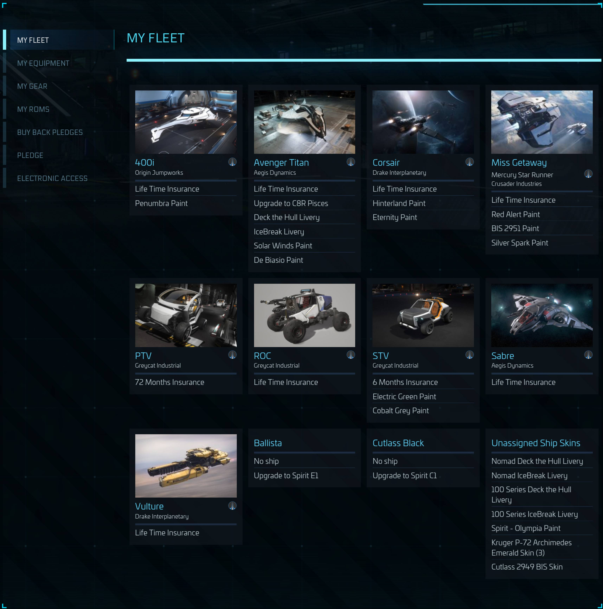
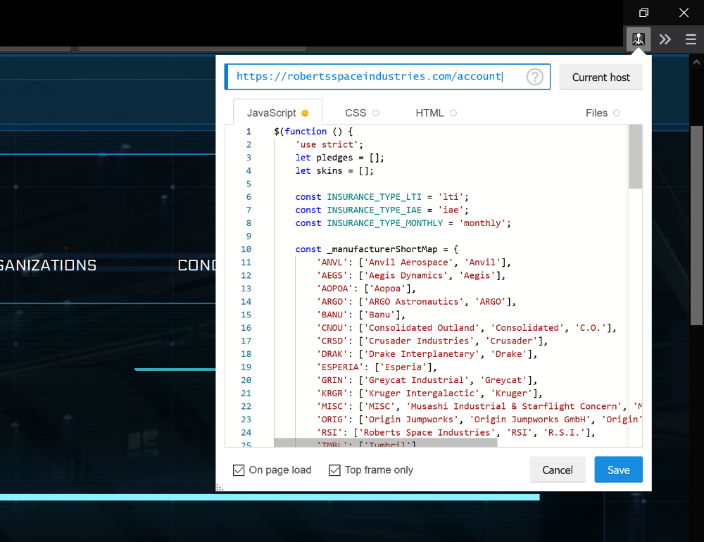

## Star Citizen - Fleet Info

This code injects a new sub page in the account section of https://robertsspaceindustries.com
On this page, all vehicles contained in packages are displayed with some info.

## Status

WIP prototype, so it's quite dirty. Expect bugs.

## How to use

There is no dedicated browser extension yet.

Best way is to use any script injection plugin for your browser and inject the 
contents of fleetInfo.js on "https://robertsspaceindustries.com/account" and its sub pages.

I use [https://addons.mozilla.org/de/firefox/addon/codeinjector](https://addons.mozilla.org/de/firefox/addon/codeinjector)
([https://github.com/Lor-Saba/Code-Injector](https://github.com/Lor-Saba/Code-Injector))

It's also available for Chrome.

Due to some fancy caching by CIG, i had to add a fix for the pagesize of the normal pledge list. You might want to edit the PLEDGE_LIST_PAGE_SIZE property at the top of the script.

## Acknowledgment

I borrowed some code from [https://github.com/Ioni14/fleet-manager-extension](https://github.com/Ioni14/fleet-manager-extension),
which is licensed under the MIT License and copyrighted by Thomas Talbot. Thanks to him.

## Copyright & License

Copyright (c) Sophie Kühn

This application is made available under the GNU General Public License v3.0.  
Please see the [LICENSE](LICENSE) file for further details.
